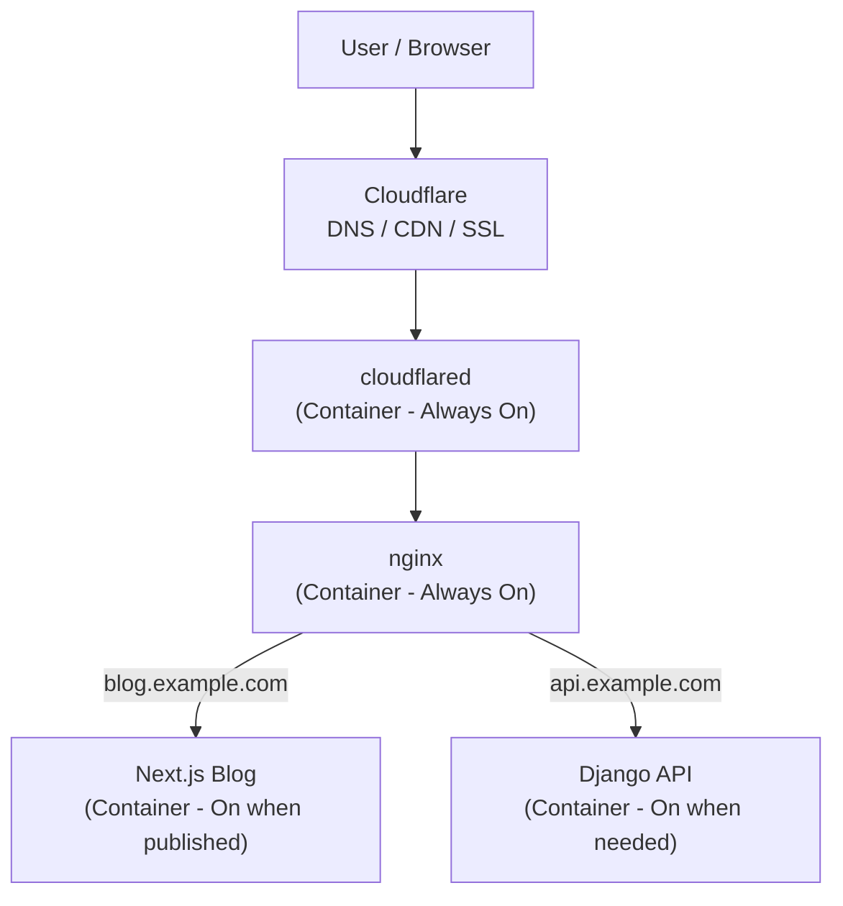

## Hi there 👋
- I'm a vocational student.
- myportfolio:[my portfolio](https://haru-0035-git.github.io/my-page/)
- myapp:[my app](https://word-trainer-seven.vercel.app/)

## 🚀 最近のアクティビティ

自宅環境図（予定）

### 構成概要

Cloudflare Tunnel を入口として常駐させ、ポート開放なしで自宅サーバーを公開しています。

- cloudflared / nginx は共通の常駐コンテナ
- 各アプリ（Next.js / Django など）は公開時のみ起動
- 外部アクセスはすべて Cloudflare を経由

リソースを抑えつつ、拡張しやすい構成です。
