## Hi there 👋
- I'm a vocational student.
- myportfolio:[my portfolio](https://haru-0035-git.github.io/my-page/)
- myapp:[my app](https://word-trainer-seven.vercel.app/)

## 🚀 最近のアクティビティ

自宅環境図（予定）

```mermaid
flowchart TB
    User["利用者 / ブラウザ"]
    CF["Cloudflare<br>DNS / CDN / SSL"]
    Tunnel["cloudflared<br>(常駐コンテナ)"]
    Nginx["nginx<br>(常駐コンテナ)"]

    Blog["ブログ<br>(公開時のみ起動)"]
    API["Django API<br>(必要な時のみ起動)"]

    User --> CF
    CF --> Tunnel
    Tunnel --> Nginx

    Nginx -->|"blog.example.com"| Blog
    Nginx -->|"api.example.com"| API
```

### 構成概要

Cloudflare Tunnel を入口として常駐させ、ポート開放なしで自宅サーバーを公開しています。

- cloudflared / nginx は共通の常駐コンテナ
- 各アプリ（Next.js / Django など）は公開時のみ起動
- 外部アクセスはすべて Cloudflare を経由

リソースを抑えつつ、拡張しやすい構成です。
